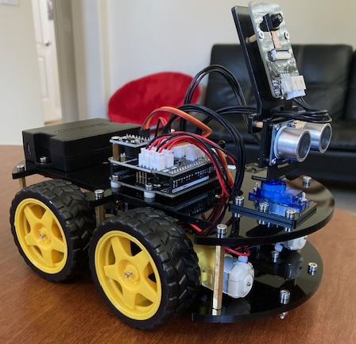
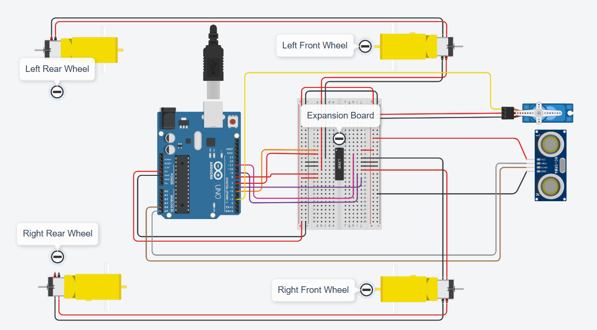

# Smart Robot Car
Hi, my name is Aarav and I built a line-tracking, obstacle-avoiding rover with four motors and an ultrasonic sensor. The car is able to be either remote controlled or is also capabale of self-driving. The process of constructing the rover consisted of several hardware pieces and also various codes, which allowed the rover to carry out specific instructions. I built this project because I have always been fascinated with cars and I wanted the chance to finally build my own mechanized rover. 

| **Engineer** | **School** | **Area of Interest** | **Grade** |
|:--:|:--:|:--:|:--:|
| Aarav R | Monte Vista High School | Mechanical Engineering | Incoming Sophomore


  
<!-- # Final Milestone
For your final milestone, explain the outcome of your project. Key details to include are:
- What you've accomplished since your previous milestone
- What your biggest challenges and triumphs were at BSE
- A summary of key topics you learned about
- What you hope to learn in the future after everything you've learned at BSE

**Don't forget to replace the text below with the embedding for your milestone video. Go to Youtube, click Share -> Embed, and copy and paste the code to replace what's below.**

<iframe width="560" height="315" src="https://www.youtube.com/embed/F7M7imOVGug" title="YouTube video player" frameborder="0" allow="accelerometer; autoplay; clipboard-write; encrypted-media; gyroscope; picture-in-picture; web-share" allowfullscreen></iframe> -->


# Second Milestone

    In my second milestone, I was able to successfully get the remote control to start working. To achieve this functionality, I had to integrate some code from the Motor Test Run into the remote control code. The remote control is paired to the four motors through the Arduino Uno development board and the shield. At this point, the car will go in any direction, until I give it another direction to go in or stop altogether. The most surprising thing about the project so far is how much I have already learned, even though it's only the end of the second week. When I first joined BlueStamp, I thought that I would simply just be building a car according to the manual. Then, I realized it was much more than that. From there, I learned how to integrate and edit code that I found online and learned how to upload it to the Arduino Uno. One challenge that I had during this milestone was putting the right amount of code from the Motor Test Run into the Remote Control code. I had to take in consideration of all the different commands for the motors and their respective definitions. Furthermore, before I edited the code, the car only moved a short distance before randomly stopping. 
    Later, it worked to the point where it would continue in any direction, until I gave it another command. Before the final milestone, the parts for my modification need to arrive, so that I can start attaching it to my car. For my modification, I plan to attach a light sensor with a photoresistor and a couple of LEDs to the Arduino chip. By adding these objects, the car will be able to sense the amount of light present in an area. If the light is low or dim, the sensor will tell the LED to turn on and vice versa. 


<iframe width="560" height="315" src="https://www.youtube.com/embed/KXaQNS0lxn8" title="YouTube video player" frameborder="0" allow="accelerometer; autoplay; clipboard-write; encrypted-media; gyroscope; picture-in-picture; web-share" allowfullscreen></iframe>

# First Milestone

In the project, there are four motors that correspond to the four different wheels. There is also a camera, an ultrasonic sensor (it allows the car to measure how far an obstacle is and then determines when to turn), and a line-tracking module. Furthermore, there is the ATMEL Mega 328 development board, which acts as the microcontroller, where all the code and programming is run through. Additionally, there was a remote control included in the kit to manually control the car. So far, the major breakthrough I have had is uploading a successful motor test run, which tested the functionality of all four motors on the base of the car, and watching the simulation run on the actual hardware. The main problem I had was getting the motors to run. In the beginning of the programming process, I spent a lot of time trying to upload the code  to the Arduino platform for the motors to move. I tried unplugging the cable and putting it in different ports and even restarted Arduino on my computer multiple times. I enlisted the help of my instructor only to figure out that there was a switch on the shield above the Arduino chip with two sides, camera and upload. Because it was on the camera side, the Arduino platform never recognized any of the code that was trying to be uploaded. Some of my future goals are to work on increasing the speed of the car, programming it to avoid different obstacles, and getting the motors to pair with the remote control. Additionally, I also want some sort of modification, either a speaker or light-sensitvity.


<iframe width="560" height="315" src="https://www.youtube.com/embed/QjIsjb6_c_I" title="YouTube video player" frameborder="0" allow="accelerometer; autoplay; clipboard-write; encrypted-media; gyroscope; picture-in-picture; web-share" allowfullscreen></iframe>

# Schematics 


# Code
```c++
#include <IRremote.h>
#include <SparkFun_TB6612.h>

#define AIN1 7
#define BIN1 8
#define AIN2 1
#define BIN2 2
#define PWMA 5
#define PWMB 6
#define STBY 3

// these constants are used to allow you to make your motor configuration 
// line up with function names like forward.  Value can be 1 or -1
const int offsetA = 1;
const int offsetB = 1;

// Initializing motors.  The library will allow you to initialize as many
// motors as you have memory for.  If you are using functions like forward
// that take 2 motors as arguements you can either write new functions or
// call the function more than once.

Motor motor1 = Motor(AIN1, AIN2, PWMA, offsetA, STBY);
Motor motor2 = Motor(BIN1, BIN2, PWMB, offsetB, STBY);

const int recvPin = 9;
IRrecv irrecv(recvPin); //Create an instance of the ``IRrecv`` class, specifying the pins it's attached to.
decode_results results;

const int in1 = 5; // in1,2 for right wheel
const int in2 = 6;
const int in3 = 2; // in3,4 for left wheel
const int in4 = 10;

const int ledPin = 13;
int speed = 150;

void setup() {
  Serial.begin(9600);

  //motor
  //pinMode(in1, OUTPUT);
  //pinMode(in2, OUTPUT);
  //pinMode(in3, OUTPUT);
  //pinMode(in4, OUTPUT);

  //UR remote
  irrecv.enableIRIn(); // Start the receiver
  Serial.println("REMOTE CONTROL START");

  //LED
  pinMode(ledPin, OUTPUT);

  forward(motor1, motor2, 150);
   delay(1000);
   brake(motor1, motor2);
   //moveforward(speed)
}

void loop() {

  if (irrecv.decode(&results)) {
    //    Serial.println(results.value,HEX);
    String key = decodeKeyValue(results.value);
    if ( key != "ERROR")
    {
      Serial.println(key);
      blinkLED();
      if (key == "+") {
        speed += 50;
      } else if (key == "-") {
        speed -= 50;
      } else if (key == "2") {
        forward(motor1, motor2, 150);
       // moveForward(speed);
        delay(1000);
      } else if (key == "1") {
        left(motor1, motor2, 100);
       // moveLeft(speed);
      } else if (key == "3") {
        right(motor1, motor2, 100);
        delay(500);
        brake(motor1, motor2);
       // moveRight(speed);
      } else if (key == "4") {
       // turnLeft(speed);
      } else if (key == "6") {
       // turnRight(speed);
      } else if (key == "7") {
      //backLeft(speed);
      } else if (key == "9") {
      //backRight(speed);
      } else if (key == "8") {
        back(motor1, motor2, -150);
       // moveBackward(speed);
        delay(500);
        brake(motor1, motor2);
      }

      if (speed >= 255) {
        speed = 255;
      }
      if (speed <= 0) {
        speed = 0;
      }
      delay(500);
      //stopMove();
    }

    irrecv.resume(); // Receive the next value
  }
}

void blinkLED() {
  for (int i = 0; i < 3; i++) {
    digitalWrite(ledPin, HIGH);
    delay(50);
    digitalWrite(ledPin, LOW);
    delay(50);
}
```

# Bill of Materials
Here's where you'll list the parts in your project. To add more rows, just copy and paste the example rows below.
Don't forget to place the link of where to buy each component inside the quotation marks in the corresponding row after href =. Follow the guide [here]([url](https://www.markdownguide.org/extended-syntax/)) to learn how to customize this to your project needs. 

| **Part** | **Note** | **Price** | **Link** |
|:--:|:--:|:--:|:--:|
| Elegoo Smart Robot Kit V4 | Matierals to build core project | $79.98 | <a href="https://www.amazon.com/dp/B07KPZ8RSZ?maas=maas_adg_362A97D58CBCE8102DCB01CBFCC13F92_afap_abs&ref_=aa_maas&tag=maas&gclid=Cj0KCQjw4s-kBhDqARIsAN-ipH2jewmYpniPACk46WkTIe49PpDmUiXHb33lgDBl9sFuCHV7G10YU2MaAi1lEALw_wcB&th=1"> Amazon.com </a> |
|:--:|:--:|:--:|:--:|
| 8-Pack 9-volt batteries | Used for powering entire project | $12.99 | <a href="https://www.amazon.com/Amazon-Basics-Performance-All-Purpose-Batteries/dp/B00MH4QM1S/ref=sr_1_1_ffob_sspa?keywords=8+pack+9+volt+batteries&qid=1687467125&sr=8-1-spons&sp_csd=d2lkZ2V0TmFtZT1zcF9hdGY&psc=1"> Amazon.com </a> |
|:--:|:--:|:--:|:--:|
| 9-volt DC Battery Power Cable Plug | Connects battery pack to the shield | $6.79 | <a href="https://www.amazon.com/Battery-Power-Barrel-Connector-Arduino/dp/B07NT79ZVB"> Amazon.com </a> |
|:--:|:--:|:--:|:--:|
| Item Name | What the item is used for | $Price | <a href="https://www.amazon.com/Arduino-A000066-ARDUINO-UNO-R3/dp/B008GRTSV6/"> Link </a> |
|:--:|:--:|:--:|:--:|
| Alinan 120 pcs Dupont Cable Breadboard Jumper Wires | Used for connecting LEDs to light sensor | $6.79 | <a href="https://www.amazon.com/Alinan-120pcs-Dupont-Breadboard-Jumper/dp/B09Q5LKJ1B/ref=asc_df_B09Q5LKJ1B/?tag=hyprod-20&linkCode=df0&hvadid=598354319261&hvpos=&hvnetw=g&hvrand=3413281763793005554&hvpone=&hvptwo=&hvqmt=&hvdev=c&hvdvcmdl=&hvlocint=&hvlocphy=9031997&hvtargid=pla-1878425922190&th=1"> Amazon.com </a> |
|:--:|:--:|:--:|:--:|
| Gikfun 10mm lED | Connected to light sensor and will turn on if the light in an area is low | $7.98 | <a href="https://www.amazon.com/Gikfun-Emitting-Diodes-Diffused-Arduino/dp/B07DC5VFZ7?source=ps-sl-shoppingads-lpcontext&ref_=fplfs&psc=1&smid=A34K5WF5Z9R33P"> Amazon.com </a> |
|:--:|:--:|:--:|:--:|

# Other Resources/Examples
One of the best parts about Github is that you can view how other people set up their own work. Here are some past BSE portfolios that are awesome examples. You can view how they set up their portfolio, and you can view their index.md files to understand how they implemented different portfolio components.
- [Sparkfun Motor Test Run Library](https://learn.sparkfun.com/tutorials/tb6612fng-hookup-guide/all?gclid=CjwKCAjwkeqkBhAnEiwA5U-uM7hTbH6J6ZMSCURmsOcvQqINZed-wHCePxGhvCnHcUPRtSZOhl1TVBoCJ7UQAvD_BwE#library-and-example-code)
- [Remote Control Code](https://docs.sunfounder.com/projects/3in1-kit/en/latest/car_project/car_remote_control.html)
- [Example 3](https://arneshkumar.github.io/arneshbluestamp/)

To watch the BSE tutorial on how to create a portfolio, click here.
